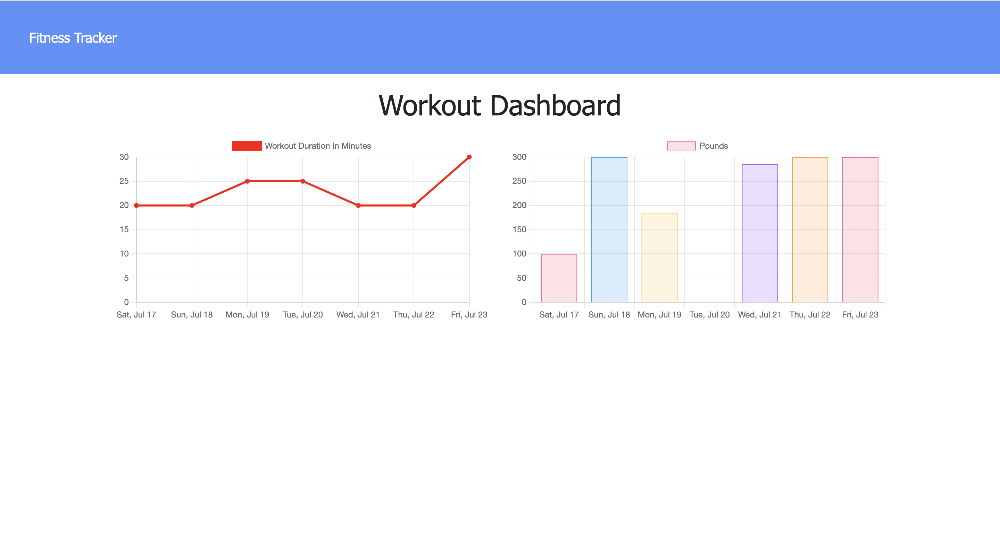

# 🏃🏽‍♀️ hw18-workout-tracker 🏃🏽‍♀️


# 📋 Description 📋

```
Fitness Tracker is an app workout that help you planning and tracking your routine exercise everyday. It has been builded with Javascript, Express Js and MongoDb. You can create resistance and cardio workouts.
On the dashboard page, it shows the last few days of total workout time along with the
total weight for each day in that period.  
```

# 💼 Technologies Used 💼

* `Node.js`
* `npm (Node Package)`
* `Javascript`
* `MongoDb`
* `Mongoose`
* `Express JS`


# 📸 Screenshots 📸




# 🔗 Application Links

* [Github](https://github.com/thuluong249/hw18-workout-tracker)
* [Heroku Deployment](https://exercise-trackerltt.herokuapp.com/)

# 📱 Contact 

* [Github](https://github.com/thuluong249)

* <a href="mailto:thujtn2019@gmmail.com">💌 Email</a> 

---